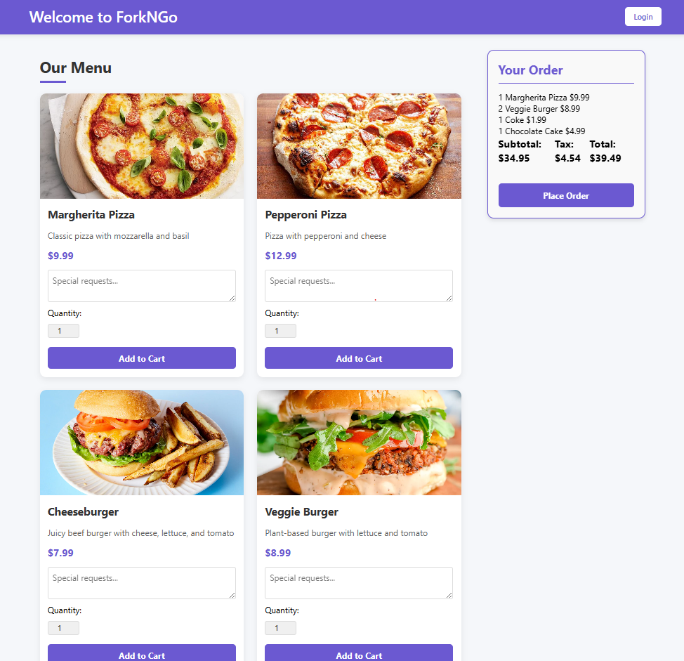
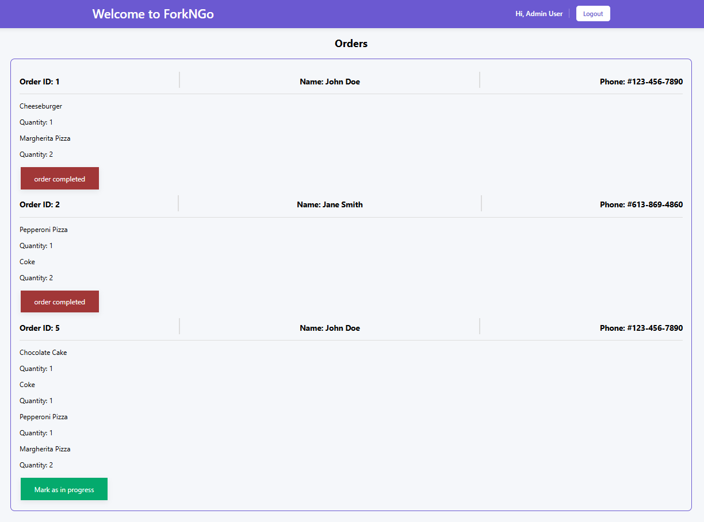

 About ForkNGo
=========
ForkNGO is a small food order/pick-up app designed for a single restaurant/establishment. 
This restaurant web application has 3 routes. A login page that redirects to the admin page or the customer page depending on the status of the user. This application has an SMS feature so that when the order status changes the customer will receive notifications for it.

## Getting Started

1. Create the `.env` by using `.env.example` as a reference: `cp .env.example .env`
2. Update the .env file with your correct local information 
  - username: `labber` 
  - password: `labber` 
  - database: `midterm`
3. Install dependencies: `npm i`
4. Reset database: `npm run db:reset`  
  - Check the db folder to see what gets created and seeded in the DB
5. Run the server: `npm run local`  
  - Note: nodemon is used, so you should not have to restart your server
6. Visit [`http://localhost:8080/login`](http://localhost:8080/login) to login
7. Visit [`http://localhost:8080/`](http://localhost:8080/) to see the main page which contains all the menu along with the cart feature to place order.
8. Visit [`http://localhost:8080/admin`](http://localhost:8080/) to see the admin page which contains all the food orders and buttoms to change the food orser status. After each status sms message will be made after every change. Button will be disabled once order has been completed.

## Warnings & Tips

- Do not edit the `layout.css` file directly, it is auto-generated by `layout.scss`.
- Split routes into their own resource-based file names, as demonstrated with `users.js` and `widgets.js`.
- Split database schema (table definitions) and seeds (inserts) into separate files, one per table. See `db` folder for pre-populated examples. 
- Use helper functions to run your SQL queries and clean up any data coming back from the database. See `db/queries` for pre-populated examples.
- Use the `npm run db:reset` command each time there is a change to the database schema or seeds. 
  - It runs through each of the files, in order, and executes them against the database. 
  - Note: you will lose all newly created (test) data each time this is run, since the schema files will tend to `DROP` the tables and recreate them.

## Dependencies

- Node 14.x or above
- NPM 6.x or above
- PG 6.x
- twilio 5.5 or above
- express-session 1.18X or above

## 📷 Gallery

## Credit/Acknowledgment

This food ordering/pick-up application is a collaborative project between Soseh Cyousefian and Ella Ye.